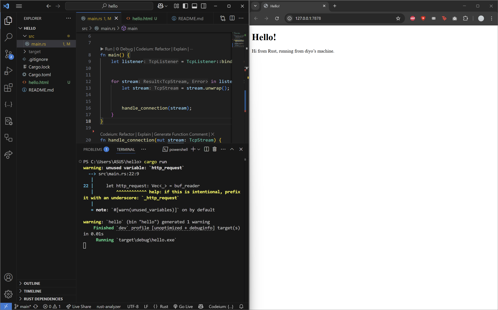
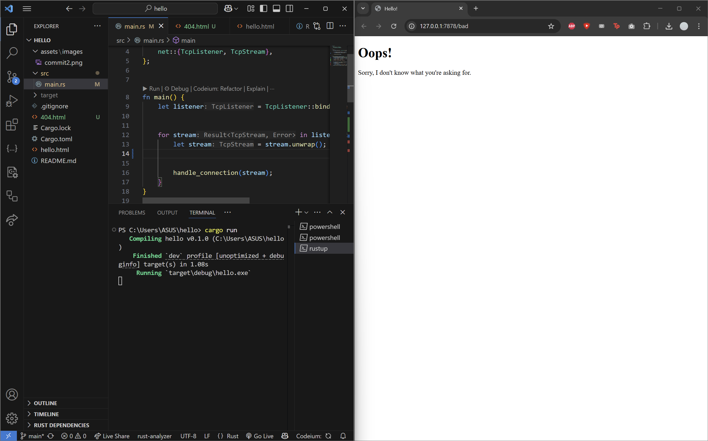
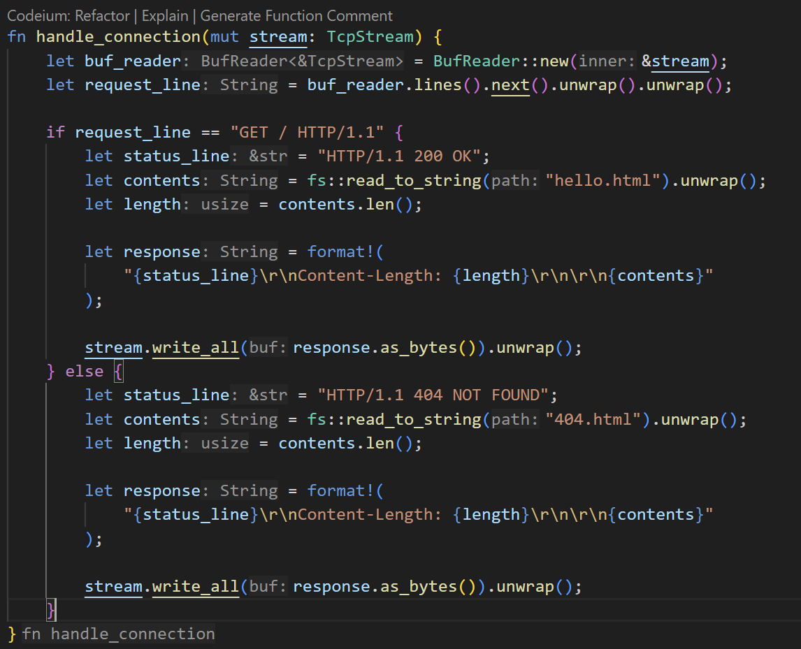
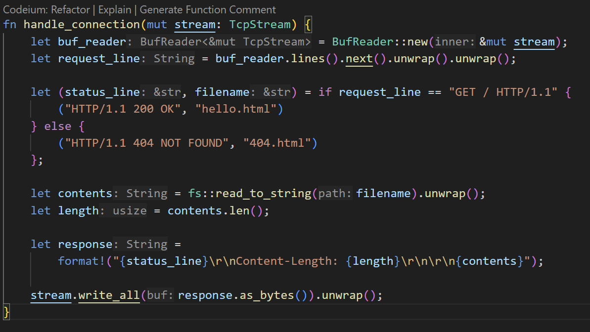

# Commit 1 Reflection

The code sets up a TCP listener on 127.0.0.1:7878, forwarding each incoming connection to the handle_connection function. Inside handle_connection, the TcpStream is wrapped in a BufReader, which reads incoming lines until it reaches an empty line indicating the end of the request headers. These header lines are collected into a vector and printed to the console, revealing typical HTTP request details. Because no response is sent back, a browser or other software initiating the connection will continue waiting until the connection times out.

# Commit 2 Reflection

After the modification, the handle_connection function returns an HTML response. The HTML content is read from the hello.html file using fs::read_to_string and stored in the contents variable as a String. In addition, the response body includes a status line and a Content-Length header, which are crucial for indicating the success or failure of the connection and for verifying the length of the response. Finally, the format! is used to combine the status line, Content-Length, and the HTML body into a single string, which is then sent over the TCP connection using stream.write_all().

# Commit 3 Reflection

The handle_connection function can filter incoming requests. If the request targets the root path, the server returns hello.html. Otherwise, the server responds with 404.html.

### Before Refactoring

### After Refactoring

Refactoring reduces repetition and makes the code more maintainable. Before the refactoring, the if/else blocks each define and construct similar responses, resulting in duplicated logic for reading a file, calculating its length, and formatting the response. By using the (status_line, filename) tuple, we move the response-building steps outside of the conditional, reducing duplication and simplifying changes.

# Commit 4 Reflection
In the updated code, an additional route (GET /sleep HTTP/1.1) is handled by introducing a 10-second delay before returning the response. This means that when the browser accesses the /sleep route, it takes longer to load because the thread sleeps for 10 seconds. Since the server processes requests synchronously, a slow route can delay handling other requests if many users connect simultaneously. This behavior highlights the importance of considering concurrency or asynchronous processing in a production environment.

# Commit 5 Reflection
A thread pool is a group of pre-initialized threads that are ready to handle tasks concurrently. When a new task arrives, one of these threads is assigned to execute the job, while the others stay available for incoming tasks. Once the thread finishes its work, it returns to the pool for future tasks. In this commit, the thread pool is implemented using a ThreadPool struct that manages a set number of Worker instances and a Job type that represents the tasks. Communication is done via message passing, with the ThreadPool acting as the sender and each Worker as the receiver of tasks.

The code defines a ThreadPool structure that holds a fixed number of worker threads and a sender for dispatching tasks through an mpsc channel. Each worker is represented by a Worker struct that spawns a thread, which continuously waits for and executes jobs from a shared, mutex-protected receiver. A job is defined as a boxed closure that implements FnOnce() + Send + 'static, allowing it to be safely executed in a thread, and the main function dispatches tasks like handling TCP connections using the execute method. This design enables the server to process multiple requests concurrently, ensuring that slow tasks do not block the entire server.

